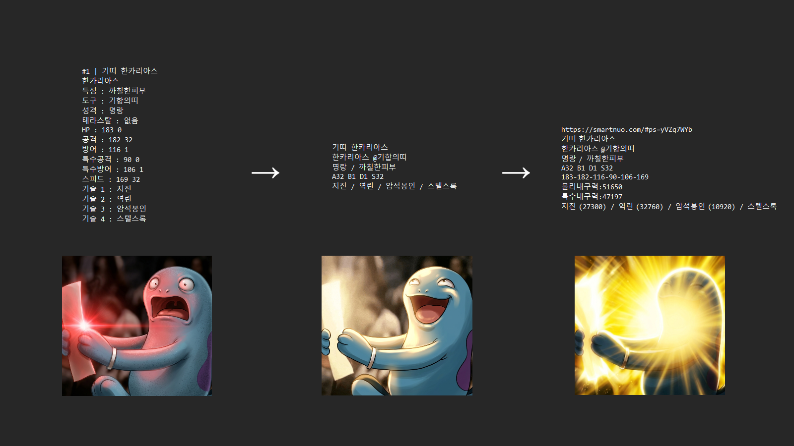
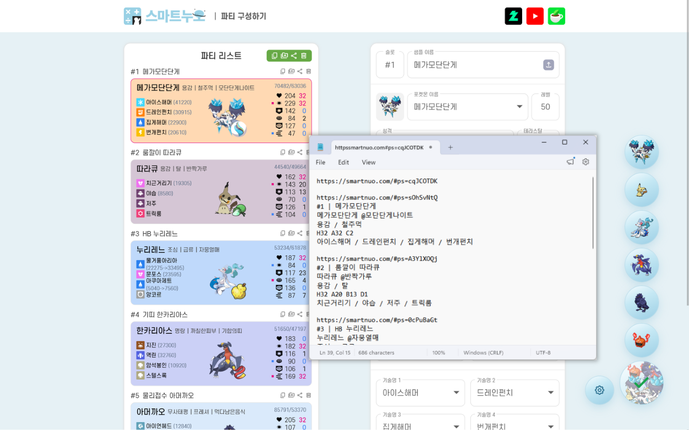
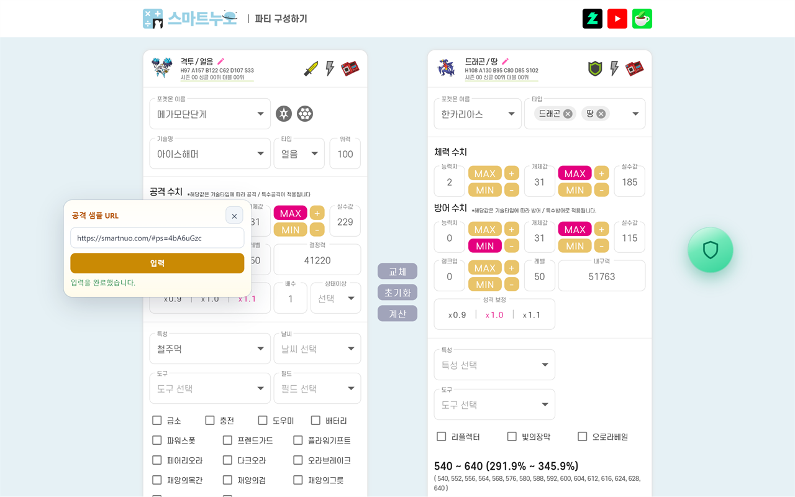

# 도우미누오 (크롬 확장 프로그램 v1.0.0)

## 소개

> **도우미누오**는 [스마트누오](https://smartnuo.com) 사용자를 위한 **비공식 편의성 확장 프로그램**입니다.

공유 및 저장용 샘플 작성, 계산기 입력, 샘플 조정 중 수치 확인 등 일상적인 작업들을 몇 번의 클릭으로 간단하게 처리하여 쾌적한 환경을 제공합니다.

- **스마트누오 공유 URL**만 입력하면, 설정을 **짧고 읽기 쉬운 요약 샘플**로 변환  
(커뮤니티·블로그·메모장 등에 적합한 가독성 높은 형식)
- 파티 또는 샘플 URL을 함께 붙여 **나중에 손쉽게 불러오기·수정 가능**
- **결정력**, **내구력** 등 주요 수치 요약 추가 지원
- **Pokémon Showdown / PokePaste** 스타일의 영문 샘플 변환·복붙 지원
- 스마트누오 **데미지 계산기** 자동 입력 (공격측·수비측 URL 각각 지원)

---

## 설치

### Chrome 웹 스토어 (권장)

크롬 웹 스토어에 등록된 **도우미누오** 페이지에 접속해 **Chrome에 추가** 버튼을 누르면 설치가 완료됩니다.
업데이트는 크롬이 자동으로 처리합니다.

<!-- TODO: 스토어 등록 완료 후 실제 URL 로 교체 -->
[도우미누오 크롬 웹 스토어 페이지](#)

> 아직 스토어 등록 심사가 끝나기 전이라면 아래 **소스에서 직접 설치** 방법을 이용해 주세요.

### 소스에서 직접 설치 (개발자용 / 사전 배포용)

1. 본 저장소를 zip으로 내려받거나 `git clone` 합니다.
2. zip을 내려받은 경우 **압축을 풉니다.**
3. 풀린 폴더 안에 `extension` 폴더가 있는지 확인합니다.
4. 크롬에서 **확장 프로그램** 창을 엽니다.
    - **방법 1:** 주소창에 `chrome://extensions` 를 입력합니다.
    - **방법 2:** 오른쪽 위 **점 세 개(더보기)** → **확장 프로그램** → **확장 프로그램 관리** 를 클릭합니다.
5. 오른쪽 위 **개발자 모드**를 켭니다.
6. 왼쪽 위 **압축해제된 확장 프로그램 로드**를 누릅니다.
7. 압축을 푼 폴더 내의 `extension` 폴더를 선택합니다.
8. **도우미누오** 아이콘이 보이면 설치 완료입니다.

업데이트할 때는 기존 파일을 덮어쓴 뒤, `chrome://extensions` 에서 해당 확장 프로그램의 **새로고침(↻)** 을 누르면 됩니다.

---

## 사용법 (플로팅 버튼)

### 샘플 변환

1. [스마트누오](https://smartnuo.com/)에 접속하여 파티 구성하기에 들어갑니다.
2. 페이지 우측 하단 플로팅 버튼에 커서를 이동합니다.
3. 왼쪽 **설정 메뉴**에서 원하는 옵션을 설정합니다.
4. **단일 샘플** 혹은 **파티 전체** 중 샘플을 얻고 싶은 버튼을 **클릭**합니다.
5. 잠시 후 **자동**으로 클립보드에 **복사**됩니다.
메모장에 저장하여 필요할 때 쓰거나, 커뮤니티와 블로그 등에 샘플을 곧바로 올릴 수 있습니다.

#### 출력 옵션(체크박스)

- **URL:** 결과 맨 위에 **파티/샘플 링크**를 붙입니다. 끄면 순수 요약 텍스트만 나옵니다.
- **실수치:** 실수치 표시를 추가합니다.
- **결정력:** 각 기술에 결정력을 표시합니다. 지닌물건과 특성의 효과를 반영합니다. 조건부일 경우 `기술명 (기본→버프)`처럼 표시될 수 있습니다.
- **내구력:** 물리 및 특수 내구력을 표시합니다. 지닌물건과 특성의 효과를 반영하여 `기본내구력 (최종내구력)`처럼 표시될 수 있습니다.
- **Showdown:** 샘플 형식을 **Pokémon Showdown / PokePaste**에 가까운 영문 블록 형식으로 변환합니다.

### 계산기 입력

1. 브라우저에서 [스마트누오](https://smartnuo.com/) 데미지 계산기를 엽니다.
2. **공격측** 혹은 **수비측** 플로팅 버튼을 클릭합니다.
3. **입력란**에 **단일 샘플 URL**을 넣습니다. **파티 URL**은 지원하지 않습니다.
4. **입력** 버튼을 누릅니다.
5. 확장 프로그램이 공유 URL을 통해 샘플을 읽고, 열려 있는 스마트누오 탭의 계산기에 종족, 노력치, 기술, 도구, 특성 등을 자동으로 채웁니다.
계산기 입력 기능을 처음 사용할 때는 입력이 완료되기까지 시간이 다소 소요될 수 있습니다.

---

## 추가 편의 기능

### 파티 슬롯별 결정력 및 내구력 표시 기능

팀빌더 페이지에서 포켓몬별 결정력과 내구력을 계산기를 거칠 필요없이 실시간으로 확인할 수 있습니다.
환경설정 창에서 켜고 끌 수 있습니다.

### 환경설정

크롬 툴바에서 도우미누오 팝업창을 열어 환경설정에 들어갈 수 있습니다.
팝업 테마, 플로팅 버튼 표시 여부, 팀빌더 인라인 수치 표시 여부 등을 조절할 수 있습니다.

---

## 자주 묻는 질문

- **Q: 가지고 있는 샘플을 스마트누오 팀빌더 페이지에 어떻게 불러오나요?**
  - **A:** 샘플 혹은 파티의 공유 URL(`https://smartnuo.com/#ps=...`)을 복사합니다. 페이지 우측 상단에 위치한 **업로드 버튼**을 클릭합니다. 입력란에 URL을 붙여넣어 불러옵니다.
- **Q: 플로팅 버튼이 안 떠요.**
  - **A:** 확장 프로그램을 새로 설치한 경우 스마트누오 페이지를 **새로고침** 해보시기 바랍니다. **팀빌더 페이지**의 경우 파티에 **포켓몬이 최소 하나라도 있어야** 버튼이 활성화됩니다.

---

## 개인정보 보호 및 권한

본 확장 프로그램은 사용자의 어떠한 개인정보도 수집하거나 전송하지 않습니다.
모든 환경설정 데이터는 브라우저 로컬 저장소에만 안전하게 보관됩니다.
자세한 내용은 [PRIVACY.md](./PRIVACY.md) 를 참고해 주세요.

---

## 버그 제보 및 기능 건의

이용 중 문제가 발생하거나 개선 아이디어가 있다면, 확장 프로그램 팝업 하단의 **문의·제보** 버튼을 클릭하거나 [해당 링크](https://docs.google.com/forms/d/e/1FAIpQLSfA97NKxUqModwfLulTKqiBrSmnYvwPUEaMXa1__-lP5orG1Q/viewform?usp=header)를 이용해 주세요.

---

## 라이선스·면책

본 확장 프로그램은 개인이 개발한 비공식 편의 도구로, 스마트누오 공식 운영진과는 어떠한 제휴나 협력 관계도 없습니다.
스마트누오 웹사이트의 업데이트나 구조 변경 등으로 인해, 일부 기능이 예고 없이 정상적으로 작동하지 않거나 제한될 수 있습니다.
또한 Chrome 웹 스토어가 아닌 경로로 배포되는 경우, 설치하는 분께 반드시 위의 설치 방법을 함께 안내해 주세요.

본 저장소의 소스 코드는 투명성 확보를 위해 공개되어 있을 뿐, 명시적인 공개 라이선스가 부여되어 있지 않습니다. 별도의 명시적 허락이 없는 한 본 저장소 내 모든 코드와 에셋에 대한 권리는 저작자가 보유합니다 (**All rights reserved**).